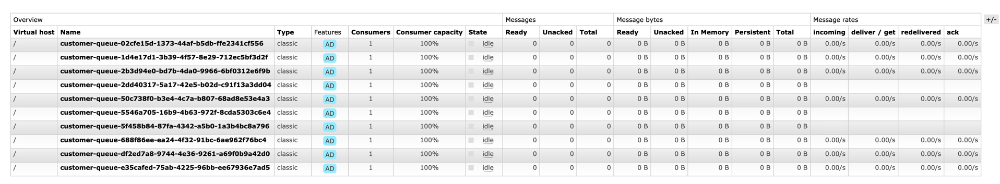

## How to run

1. Build `producer` and `consumer` using `./gradlew bootJar`
2. `docker-compose build`
3. `docker-compose up`


## Experiments

### Use 10 customer IDs (`int` wrapped as `String`):

#### 10 000 messages distributed among 5 consumers:
* consumer #1: 1984 messages
* consumer #2: 2010 messages
* consumer #3: 1996 messages
* consumer #4: 1032 messages
* consumer #5: 2978 messages

Almost uniform distribution, except consumer #4

#### 10 000 messages distributed among 10 consumers:
* consumer #1: 1975 messages
* consumer #2: 0 messages
* consumer #3: 0 messages
* consumer #4: 1989 messages
* consumer #5: 997 messages
* consumer #6: 978 messages
* consumer #7: 0 messages
* consumer #8: 2003 messages
* consumer #9: 1032 messages
* consumer #10: 1026 messages

Looks like 3 consumers out of 10 didn't get any message :(




```shell
2> erlang:phash2("1").
129604536
3> erlang:phash2("2").
123894899
4> erlang:phash2("3").
100988150
5> erlang:phash2("4").
45642519
6> erlang:phash2("5").
1444992
7> erlang:phash2("6").
110132422
8> erlang:phash2("7").
96643684
9> erlang:phash2("8").
66522585
10> erlang:phash2("9").
69041393
11> erlang:phash2("10").
128165257
```

### Use 10000 customer IDs (`int` wrapped as `String`):

#### 100 000 messages distributed among 10 consumers:
* consumer #1: 9960 messages
* consumer #2: 9662 messages
* consumer #3: 10190 messages
* consumer #4: 10253 messages
* consumer #5: 10036 messages
* consumer #6: 10054 messages
* consumer #7: 9264 messages
* consumer #8: 10155 messages
* consumer #9: 10536 messages
* consumer #10: 9890 messages

